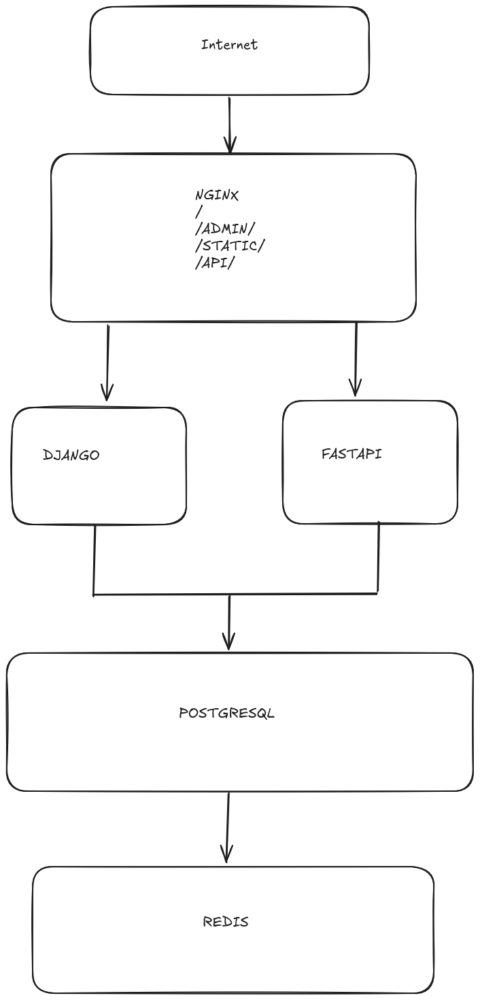
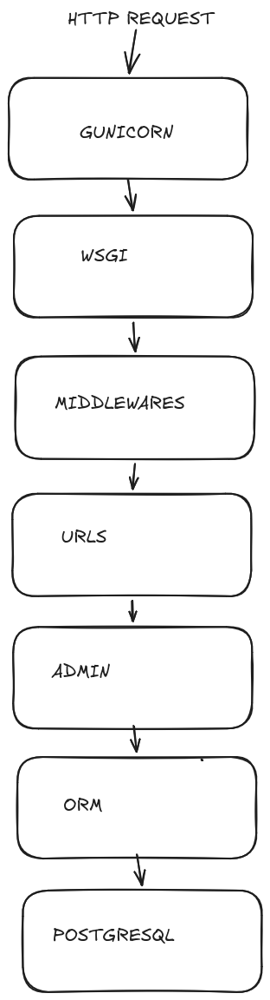
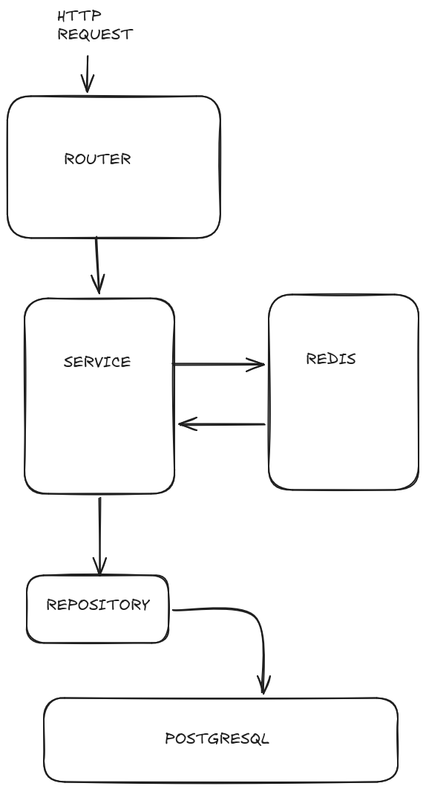
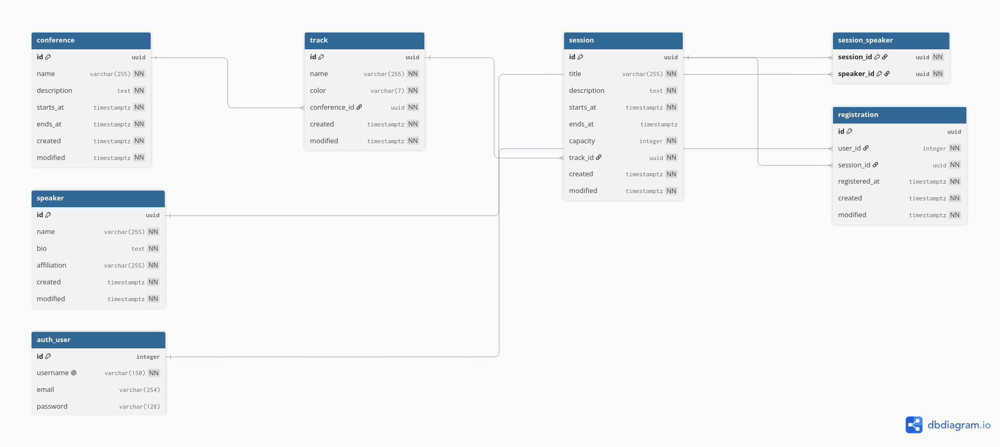

# Conference Backend — Symposium API

Backend completo para plataforma de conferencias académicas.
Stack: Django 5 + FastAPI + PostgreSQL + Redis + Nginx + Docker Compose.

---

## Cómo correr

```bash
git clone <url>
cd examen-appweb-2
cp .env.example .env
docker compose up --build
```

Después de ~30 segundos todo el stack está disponible:

| URL | Descripción |
|-----|-------------|
| http://localhost/ | Frontend |
| http://localhost/admin/ | Django Admin |
| http://localhost/api/v1/sessions/ | Listado de sesiones |
| http://localhost/api/v1/tracks/ | Listado de tracks |
| http://localhost/api/v1/healthz | Health check |
| http://localhost/api/openapi.json | OpenAPI schema |
| http://localhost/api/docs | Swagger UI |

Credenciales del admin: las que están en tu `.env` (`DJANGO_SUPERUSER_USERNAME` / `DJANGO_SUPERUSER_PASSWORD`).
Por defecto: `admin` / `admin1234`.

---

## Cómo testear

```bash
# Tests Django
docker compose run --rm django python manage.py test content

# Tests FastAPI
docker compose run --rm fastapi pytest tests/ -v

# Verificar graceful degradation
docker stop examen-appweb-2-redis-1
curl http://localhost/api/v1/sessions/
# La API sigue respondiendo desde Postgres

# Volver a levantar Redis
docker start examen-appweb-2-redis-1
```

---

## Arquitectura del sistema



---

## Arquitectura Django — MTV



---

## Arquitectura FastAPI — Capas



---

## Diagrama ER



---

## C4 — Diagrama de contexto

```
┌─────────────────────────────────────────────────────────────┐
│                    Sistema Conference                       │
│                                                             │
│   ┌─────────┐     HTTP      ┌──────────────────────────┐   │
│   │  User   │──────────────►│  Nginx (reverse proxy)   │   │
│   │(browser)│               └──────┬───────────┬───────┘   │
│   └─────────┘                      │           │           │
│                                    ▼           ▼           │
│   ┌─────────┐               ┌──────────┐ ┌──────────┐     │
│   │  Admin  │──────────────►│  Django  │ │ FastAPI  │     │
│   │  (ops)  │               │  Admin   │ │  API     │     │
│   └─────────┘               └────┬─────┘ └────┬─────┘     │
│                                  │             │           │
│                                  ▼             ▼           │
│                           ┌────────────────────────┐       │
│                           │      PostgreSQL         │       │
│                           └────────────────────────┘       │
│                                        ▲                   │
│                           ┌────────────┴───────────┐       │
│                           │        Redis            │       │
│                           └────────────────────────┘       │
└─────────────────────────────────────────────────────────────┘
```

---

## Endpoints disponibles

```
GET /api/v1/sessions/
  ?q=          búsqueda por título o descripción
  ?track=      filtro por track UUID
  ?day=        filtro por día (YYYY-MM-DD)
  ?tz=         timezone (default: UTC)
  ?page=       número de página (default: 1)
  ?page_size=  tamaño de página (default: 12, max: 100)
  → { count, page, results: [SessionListSchema] }

GET /api/v1/sessions/{id}
  → SessionSchema (con speakers, track, capacity, registered)

GET /api/v1/sessions/{id}/availability/
  → { capacity, registered, available, is_full }

GET /api/v1/sessions/search/?query=...
  → [SessionListSchema]

GET /api/v1/tracks/
  → [TrackSchema] (con conference anidada)

GET /api/v1/conferences/
  → [ConferenceSchema]

GET /api/v1/conferences/{id}
  → ConferenceSchema

GET /api/v1/healthz
  → { status: "ok" }
```

---

## Decisiones de diseño

**Schema `content` separado de `public`**
Las tablas del dominio viven en `content`, las de Django en `public`.
Dos servicios sobre la misma DB sin interferencia.

**Django solo escribe, FastAPI solo lee**
Django es la fuente de verdad. FastAPI no escribe nada.
Evita conflictos entre los dos ORMs.

**Caché con TTL de 300 segundos**
Respuestas de lista y detalle se cachean en Redis por 5 minutos.
Si Redis no está disponible, la API responde desde Postgres
sin error — graceful degradation por diseño.

**Paginación page/page_size**
El frontend espera `{ count, page, results }`.
Se respeta el contrato del frontend como fuente de verdad.

**UUID como primary keys**
Evita enumeración de recursos y facilita distribución futura.

**timestamptz en todos los campos de fecha**
Django corre con `USE_TZ=True` y `TIME_ZONE=UTC`.
Las fechas se guardan en UTC, se convierten al timezone
del usuario en el query parameter `?tz=`.

**Business logic — Capacity Enforcement**
`/availability/` calcula `capacity - COUNT(registrations)` en tiempo
real. La consulta es correcta bajo lecturas concurrentes porque
usa una sola transacción de base de datos.

---

## Trade-offs

| Decisión | Alternativa | Por qué elegí esto |
|----------|-------------|---------------------|
| TTL simple en Redis | Django signals para invalidación inmediata | Más simple, datos cambian poco desde el admin |
| SQLAlchemy sync | SQLAlchemy async + asyncpg | Menor complejidad, suficiente para el caso de uso |
| ILIKE para búsqueda | PostgreSQL full-text search | El product owner dijo "no separate search thing" |
| Gunicorn sync workers | Uvicorn workers para Django | Django no es async nativo en su núcleo |

---

## Con más tiempo haría

- Rate limiting por IP en FastAPI (configurable desde `.env`)
- Django signals para invalidar caché inmediatamente al modificar desde admin
- SQLAlchemy async para mejor concurrencia bajo carga
- Tests de integración end-to-end con TestContainers
- CI/CD con GitHub Actions

---

## Lo que más me enorgullece

La separación estricta de capas en FastAPI — Router → Service → Repository.
Cada capa tiene una sola responsabilidad, es testeable de forma independiente,
y ninguna capa conoce los detalles de implementación de la otra.
Eso es SOLID aplicado desde el primer modelo.

## Lo que menos me gusta

El seed data genera sesiones con `ends_at` null porque el campo es nullable.
En producción `ends_at` debería ser obligatorio — una sesión sin hora de
fin no tiene sentido en un sistema de conferencias real.
